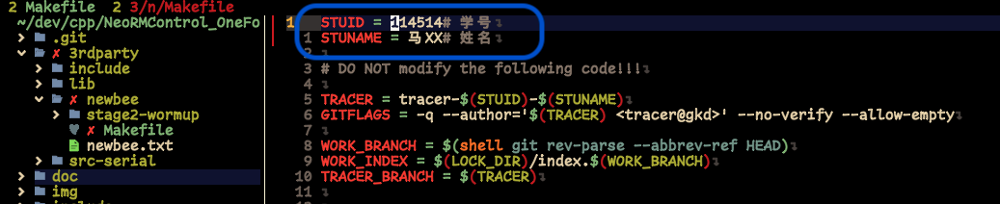
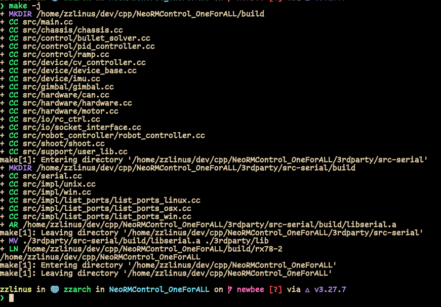
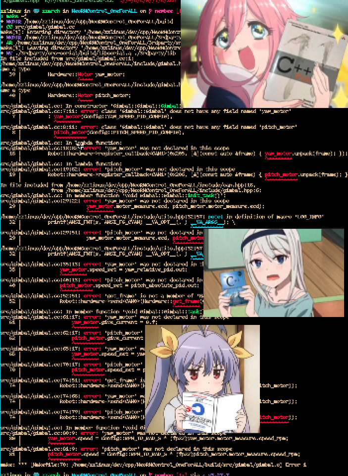
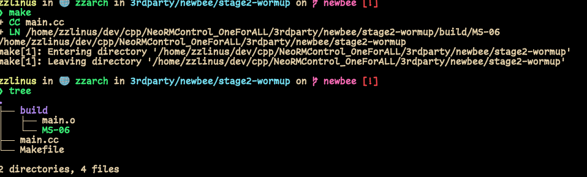

# Workflow && toolchain basics
1) 请仔细阅读[提问的智慧](https://github.com/ryanhanwu/How-To-Ask-Questions-The-Smart-Way/blob/master/README-zh_CN.md)跟[别像弱智一样提问](https://github.com/tangx/Stop-Ask-Questions-The-Stupid-Ways/blob/master/README.md)并写一封简短的读后感
2) 创个github账号
	 fork电控代码 
	 在`/3rdparty/neeewbee.txt`中添加自己的名字
	 提交commit	
	 通过[pr](https://docs.github.com/en/pull-requests/collaborating-with-pull-requests/proposing-changes-to-your-work-with-pull-requests/about-pull-requests)的形式把你的commit提交到电控代码repo的newbee分支
		 (这个pr不需要完成任何考核相关代码)

3) 成功编译电控代码
	- newbee 分支正确食用方式： 目录结构大概长这样
		- 后面有`*`的`Makefile`是会用到的
	```
	.
	├── 3rdparty
	│   ├── include
	│   │   └── serial
	│   │       └── impl
	│   ├── lib
	│   ├── newbee
	│   │   ├── Makefile   *
	│	│	├── stage1
	│   │   └── stage2-wormup
	│   │       └── Makefile   *
	│   └── src-serial
	│       ├── include
	│       │   └── serial
	│       │       └── impl
	│       ├── Makefile
	│       └── src
	│           └── impl
	│               └── list_ports
	├── Makefile   *
	├── doc
	├── img
	├── include
	│   └── device
	└── src
	    ├── chassis
	    ├── control
	    ├── device
	    ├── gimbal
	    ├── hardware
	    ├── io
	    ├── robot_controller
	    ├── shoot
	    └── support
	```
	- 首先编辑 `$(ROOT)/3rdparty/newbee/Makefile` 中的个人信息方便我们的考核，你的每一次编译，运行都会跟时间一起被记录，你到底是不是自己写还是让ai写的，一眼就可以看得出来。不要去动这个文件中除了姓名学号以外的任何代码，你也不想因为这样的失误导致明明认真多了东西结果被拒了吧🤡
	
	- 编译依赖：`gcc10`或以上, [linux-can/can-utils](https://github.com/linux-can/can-utils/releases), `make`, `(CMake)`
	- 编译电控代码在项目根目录打开命令行
	```bash
	$ make -j8
	```
	- 如果编译正常会在 $(ROOT)/build 生成 可执行文件 rx78-2
	
	- 当然，你们拿到手的代码是无法直接通过编译的，我故意去掉了一些头文件的`include`跟一些函数的定义，这会导致你们编译与链接时出错，如果你抱怨你没有学过C艹，我当然细心的帮你考虑到了这一点，特地选了一个既是是在C里也会经常出现的编译链接错误。我做这个的目的是想考察一下各位同学阅读代码的能力，跟基础的语言掌握水平。在不提运行时程序正确性的情况下，让代码通过编译是一个只需要对编程语言本身有一定了解，跟一定的阅读代码的能力与看报错先不尿裤子的基本功。比如隔壁硬件组接受板子整天冒烟跟呼吸一样自然，这很重要
	- 你们拿到手大概会是这样
		你可能有点急了，但是你先别急，起码不是runtime error对吧
		
4) 成功编译考核stage2代码
	- 在 `$(ROOT)/3rdparty/newbee/stage2-wormup` 中打开命令行
	```bash
	$ make -j8
	```
	- 如果编译正常会在 $(STAGE2)/build 生成 可执行文件 `MS-06`
	

# 二阶段考核
...

# 最终提交要求
- 请保证提交完整考核的[pr](https://docs.github.com/en/pull-requests/collaborating-with-pull-requests/proposing-changes-to-your-work-with-pull-requests/about-pull-requests)里
	- 读后感放在`$(ROOT)/3rdparty/newbee/stage1`文件夹里
	- stage2放在`$(ROOT)/3rdparty/newbee/stage2-warmup`文件夹里
    - fork后的仓库，需要保证trace分支被提交，我会在看到第二个最终审核pr之后去你们fork的仓库看trace分支的记录😃
