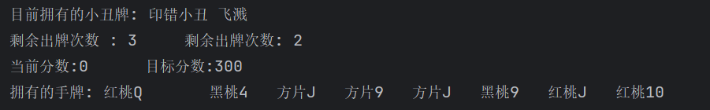
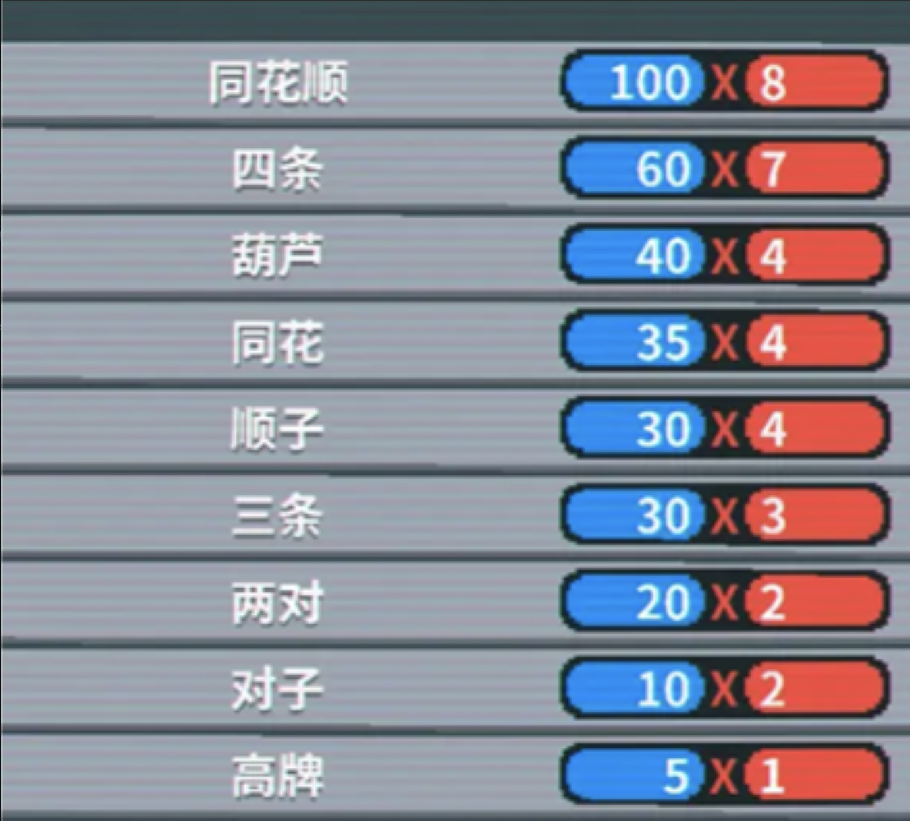

# 说明
因出题人前段时间迷上了玩小丑牌，现在想要你实现一个简单的小丑牌（没玩过也不要紧，具体规则都有说明，当然，你要是觉得规则哪里没有说明白可以上网查小丑牌的规则）
# 背景介绍：
小丑牌这个游戏有很多个回合，每个回合一开始初始化牌库并发牌，一回合内有若干次出牌机会，和弃牌机会，同时每一回合有一个你需要达到的分数，只有在出牌机会用完前达到这个分数才算通关这个回合，否则失败结束游戏。牌区分为牌库，手牌区，小丑牌区，牌库和手牌区用于存放牌，每回合刷新，小丑牌区用于存放小丑牌（一种特殊的卡牌），小丑牌不随回合更新而且小丑牌区不设卡牌上限。具体细节每一小问会详细说明，祝你好运。

# 规则机制
1) 回合开始时初始化牌库，总共有52张牌，每张牌有一个点数，是2~10，JQKA中的一个，同时还有一个花色（目前这些跟普通的扑克牌完全一样，只不过去掉大小王）。但同时每张牌还有一个权值，数字牌的权值和数字本身相同，JQK的权值都为10，A的权值为11。
2) 每一回合所需要达到的目标分数公式为 （i 为当前回合数，初始为1）。然后开始发牌，玩家的手牌上限是8，发牌时从牌库中随机选择8张牌（并将这8张牌从牌库中移动到手牌区），并将每张手牌的点数、花色，当前分数（初始为0）、目标分数，出牌弃牌剩余次数（初始均为3），以及目前拥有的小丑牌输出至控制台（具体可见下图）。

3) 每次玩家可以从控制台输入1~5个序号（手牌编号从左至右，从1开始编号），如果全部为负数，则弃掉这些编号的手牌，如果全部为正数，则选择这些编号的手牌并出牌。保证输入的序号一定合法，即不会越界，出现字母，一行里既有正数又有负数等情况。出牌或弃牌后你需要从牌库中补充手牌至上限，无论是出牌还是弃牌，这些牌在这一回合内都不会出现。
4) 完成得分计算。出牌的得分分为两部分：筹码区和倍率区，根据你所出的牌型会有一个基础的筹码和倍率（具体见下图），然后再把你打出牌里的有效牌（即组成牌型的牌）的权值加到筹码区，最后把筹码区和倍率区的数字相乘，就是你这一次打出牌的得分。

如图，蓝色是基础筹码，红色是基础倍率同花为5张牌花色都相同，顺子为5张牌的点数都是连续，同花顺即同时满足同花和顺子的牌，四条为存在四张牌点数相同（三条对子同理），葫芦则是三条+对子（俗称三带二），高牌则是不符合以上牌型的牌。这里举个例子，如果你打出了4张9和一个8，按照从上往下的优先级，打出的牌型是四条，基础筹码是60，基础倍率是7，然后有效牌计算筹码（即这里的4张9），最后得到的分数是（60+9+9+9+9）*7=672。8在这里不计分，但在此回合这张牌也不会再出现。
5) 完成计分累积和判断胜负，如果在出牌次数用完之前当前得分达到目标分数则胜利并进入下一回合，否则失败并询问玩家是否重新来一局，若是，则全部初始化并从第一回合重新开始。

- 至此，你已经完成了小丑牌这个游戏的第一部分，可喜可贺，这个游戏已经可以正常游玩了（不过缺少小丑牌的加成你根本完成不了几个回合）。接下来的几题都是围绕着小丑牌展开，这也是这个游戏的精华（不然这个游戏也不会叫这个名字了）。正常情况下，每张小丑牌只能获得一次。若无特殊说明，小丑牌的效果在每一次出牌最后（即加上有效牌的权值后）结算一次。对于每打出一张xxx则xxx的小丑牌，一次出牌可能多次结算，但只有打出的牌满足规则且是能被计分才能进行结算。小丑牌的结算顺序为按照获得先后顺序依次结算。

# 根据小丑牌的实现难易，我把它们分为了三个部分，分别是以下三题：
6) 红色小丑：每打出一张方块/红桃牌时+4倍率；黑色小丑：每打出一张黑桃/梅花牌时+20筹码；半张小丑：如果出牌包含3张或更少的牌，+20倍率；旗帜：每一个剩余的弃牌次数+40筹码；印错小丑：随机+0~ 23区间任意数值倍率；学者：每打出一张A， +4倍率和+ 20筹码。
7) 四指：所有同花和顺子都可以由4张牌组成；游吟诗人：+2手牌上限，每回合出牌次数-1；超新星：将牌型的出牌次数添加至倍率；飞溅：每张打出的牌都计入得分。
8) 大麦克香蕉：+15倍率，回合结束时有1/4的几率摧毁此小丑牌；徒步者：打出的每一张牌会使这张牌的权值永久+4；蓝图：复制下一张小丑牌的能力；红桃和方片视为同一花色，黑桃和梅花视为同一花色。
至此，恭喜你，完成了简化版小丑牌的全部，能做到这一步实属不易。
